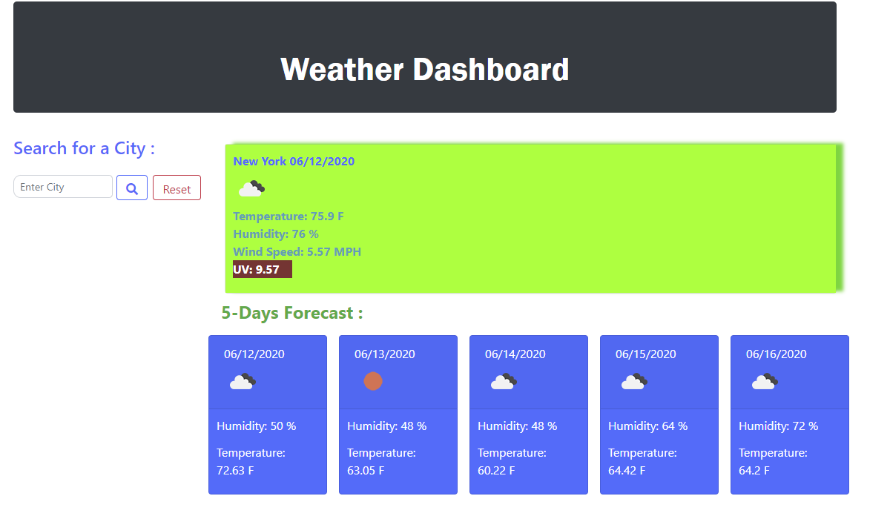

  [](https://shields.io/)
  [](https://shields.io/)
  [](https://shields.io/)
  [](https://shields.io/)
  
  

# Introduction: Weather Dashboard

Create application using openweathermap API .
Generate specific data about the citites that I was looking at and additon 5 day forecast.
## User Story

```
AS A traveler
I WANT to see the weather outlook for multiple cities
SO THAT I can plan a trip accordingly
```
## Screenshot 



## Getting Started

* Using openweathermap api key - https://openweathermap.org/api
* Using Moment-js -https://momentjs.com/
* Moment.js - Documentation.
* Install moment.js with Node or copy a script - https://cdnjs.cloudflare.com/ajax/libs/moment.js/2.25.0/locale/af.min.js
* Using link - https://use.fontawesome.com/releases/v5.8.1/css/all.css;
* Bootstrap link - at Bootstrap  JS, Popper.js, and jQuery : Using Modal.
* For AJAX - https://code.jquery.com/ using minified version .

### Prerequisites

Visual Studio Code / Sublime Text.

## Built With

- HTML 5 
- CSS
- JavaScript

## Authors

- Philip Kouchner
- Github link -  https://philipk-webdev.github.io/Weather-Dashboard/